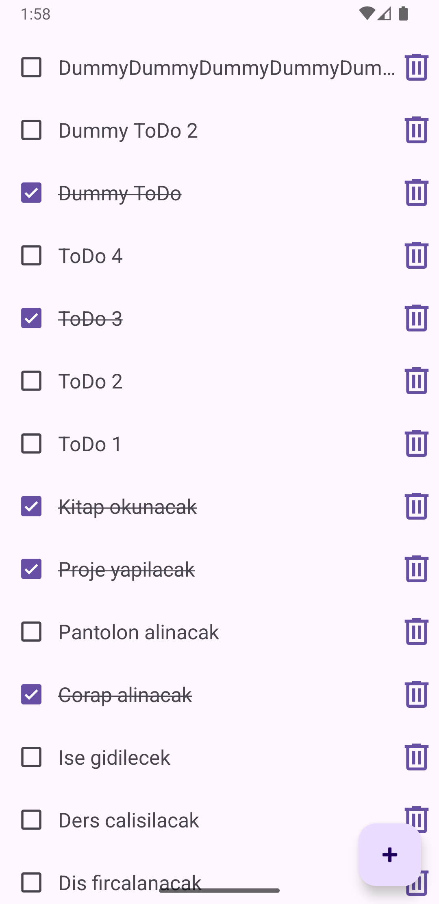
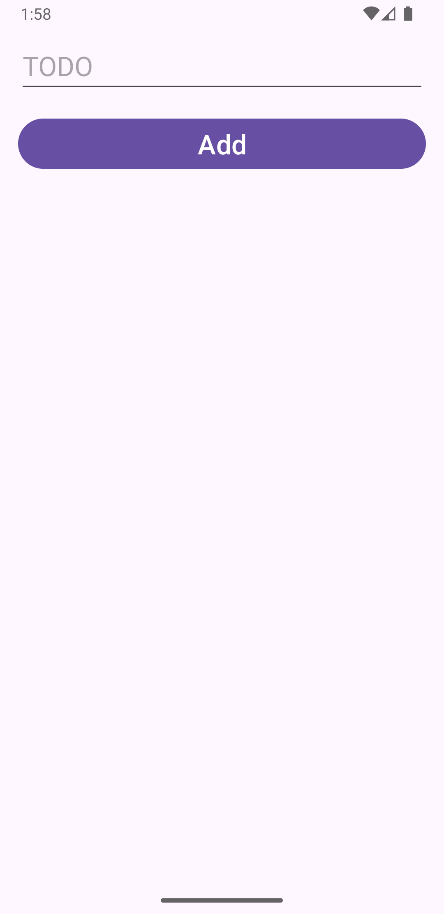
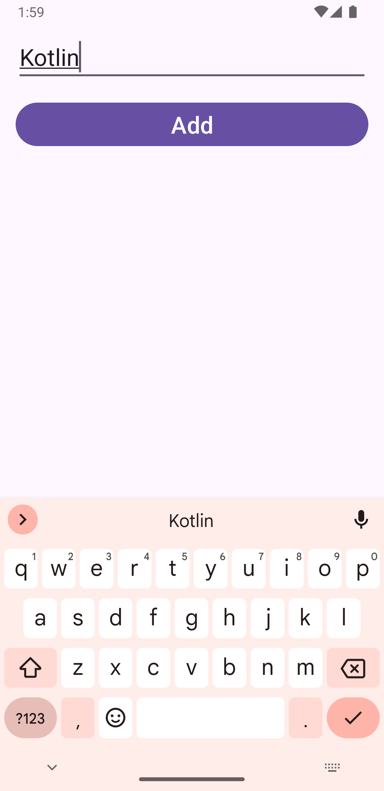

# ToDoList

+ Kotlin öğrenirken yaptığım ikinci uygulamamı paylaşmak istedim. ToDoList, basit bir todo not tutma uygulamasıdır. Kullanıcı, başlık bilgilerini girip yerel veritabanına kaydettiği yapılacaklar listesini istediği zaman görüntüleyebilir, yapıldı olarak işaretleyebilir ve silebilir.

## Temel Özellikler:

+ Başlık bilgileri girilen bir todo yerel veritabanında kayıt altına alınabilir.
+ Oluşturulan todo'lar ana ekranda görüntülenebilir.
+ İstenilen todo yapıldı veya yapılmadı olarak işaretlenebilir.
+ İstenilmeyen todo silinebilir.

## Kurulum:

    git clone https://github.com/cusufcan/to_do_list

## Ekran Görüntüleri:

<table>
    <tr>
        <td></td>
        <td></td>
        <td></td>
    </tr>
</table>

## Kullanılan Teknolojiler:

+ Kotlin
+ ViewBinding
+ Kotlin Coroutines
+ Room
+ Navigation

## Lisans:

    MIT

